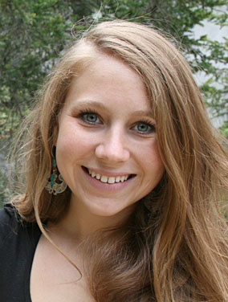
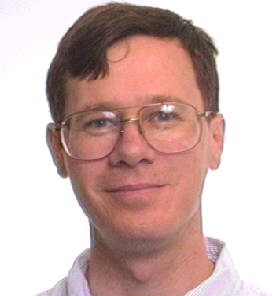

<head>

</head>

#Testing the Λ-cold-dark-matter model of cosmology
Feb 10, 2016 - [Marius Millea](http://www.cosmologyathome.org/view_profile.php?userid=990172)
{: .date}

Today we officially release the new `planck_param_sims` app at Cosmology@Home. Curious about how the results from this app contribute to science? Find out in this post, with some help from our collaborators.

Perhaps the most sought after goal in modern cosmology (at least in the short term) is to break the Λ-cold-dark-matter (or ΛCDM for short) model. By this we mean, to find a piece of data which ΛCDM fails to explain.

{: .profile}

> The ΛCDM model is our current best description of how the universe evolves in time and space. It synthesizes our best theoretical understanding of how nature works. It uses Einstein's general relativity to describe gravity and the so called "Standard Model" to describe how particles interact amongst themselves. In order to properly describe observations, it postulates that the universe began with a period of exponential expansion called "inflation," and is composed of: "baryonic matter", the well-known ordinary matter we experience everyday around us, whose microscopic properties are well known and studied; "radiation", i.e. photons and neutrinos, well known and observed particles that travel as fast (or almost) as the speed of light; "Cold Dark Matter" (CDM), a yet-to-be understood type of matter whose  gravitational effects are observed in our universe, but whose microscopic properties are still unknown; "Dark Energy" (Λ), a not-yet-well understood form of energy that is responsible for the accelerated expansion of the universe observed today. There are many things that we still don't understand about this model, however. Among others, think about the fact that the nature of the two key players (from which the model draws its name, Λ and CDM) that together make up 95% of the energy content of the universe, is still a complete mystery!  -Silvia Galli

So why are scientists trying find failures of this model which we ourselves thought up? The answer is that we know that at some level it is an approximation, and finding the failures points us in the direction of finding the deeper more fundamental explanation. This could mean hints as to the nature of dark matter, dark energy, or even of the "inflationary" phase early on in the history of the universe.  

To-date the best piece of data we have for testing the ΛCDM model are observations of the Cosmic Microwave Background (or CMB, for short). The CMB is the microwave radiation emitted by the hot plasma which was present shortly after the Big Bang, and which has been permeating and traveling throughout the universe ever since. 

{: .profile}

> The CMB is the most direct way we have of measuring the very early universe. It's broad features are a direct image of the quantum fluctuations that seeded all observable structure in the universe and therefore allows us to probe the mechanisms that created the universe and the structure in it at the origin of time. The detailed features tell us about the composition of the universe, including the fraction of dark matter and ordinary matter. Since the microwave light has been traveling through 13.8 billion years of cosmic expansion it tells us about the overall geometry of the universe and contains important clues about the recent accelerated expansion, thought to be driven by dark energy. -[Ben Wandelt](http://ilp.upmc.fr/wandelt.php)

Here is an animation of what the CMB looks like on the sky. The red spots represent regions where the radiation is hotter and the blue spots where the radiation is colder. These patterns encode the information that we seek.

The best current measurements of the CMB come from a satellite launched in 2009 called [Planck](https://en.wikipedia.org/wiki/Planck_(spacecraft)). (All of us mentioned in this post are part of the collaboration which designed, launched, and analyzes the data from this satellite.)

{: .profile}

> Planck is a satellite expressly designed to study the minute fluctuations in the temperature of the CMB across the whole sky.  A collaboration between ESA, NASA and the Canadian space agency, it is the third satellite mission to study the CMB (following [COBE](https://en.wikipedia.org/wiki/Cosmic_Background_Explorer) and [WMAP](https://en.wikipedia.org/wiki/Wilkinson_Microwave_Anisotropy_Probe)).  Named in honor of the German Nobel laureate Max Planck (1858-1947), the satellite employs 74 detectors cooled to near absolute zero, to measure the fluctuations of the CMB with an accuracy set by fundamental astrophysical limits. -[Martin White](http://w.astro.berkeley.edu/~mwhite/)

To analyze the pattern of hot and cold spots in the CMB measured by Planck, we compress this data down to the so called "power spectrum", pictured below.

{: .figure}

The power spectrum tells us how much structure there is the map at a given scale. Its similar to the equalizer on your stereo; if the bars on the left of the equalizer are large your music has a lot of bass (i.e. a lot of structure at low frequencies), where-as if the bars on the right are large, your music is has a lot of treble (high frequencies). Similarly here, the data points on the left represent the low frequency large scales, and the data points on the right the high frequency small scales (actually, some of our collaborators have taken the music analogy to its full conclusion and made [an app](http://web.physics.ucsb.edu/~jatila/CMB-sounds/CMB) which lets you listen to listen to the CMB as if it were a sound).

If you fiddle with the bass and treble knobs on your stereo, you can distort how your music sounds, but probably you will still be able to recognize the song. The key test which we are performing with the `planck_param_sims` jobs is to fiddle with the analogous "bass and treble knobs" on the Planck data, picking combinations that keep only particular scales. Then we ask, does this still sound like the ΛCDM model?

> Something more technical, like "we've got ~100" different knobs to adjust.... -[Lloyd Knox](http://www.lloydknox.com/)

The end result is that we will build up a distribution of how much we expect the "sound" of the ΛCDM model to change when analyzed in these ~100 different ways, and compare to how the actual data changes. If we find consistency with what we expect, then ΛCDM passes another precision test, and we continue to be in awe of how well we are able to to describe the universe with this simple model (while at the same time going back to the drawing board about other ways it may fail). If however we don't see consistency, then we are extremely excited because it means we've found something interesting! The most interesting possibility of course is that we are seeing hints of this model breaking down, which could point to a new and better understanding of our universe. 

We don't really know what result we'll get. A calculation of this distribution of expected changes has never been done to this scale nor to this accuracy. Part of the reason is that its a computationally expensive task. Analyzing the Planck data just once is not trivial, and doing so in a ~100 different ways, and doing *that* thousands of times, is much less so! That of course is where you as volunteers come in. With your help we will be able to map out this distribution. The first phase of this calculation should take a few weeks to a couple of months. Depending on what we find, we may extend it in various ways. I'm looking forward to seeing what we find!
